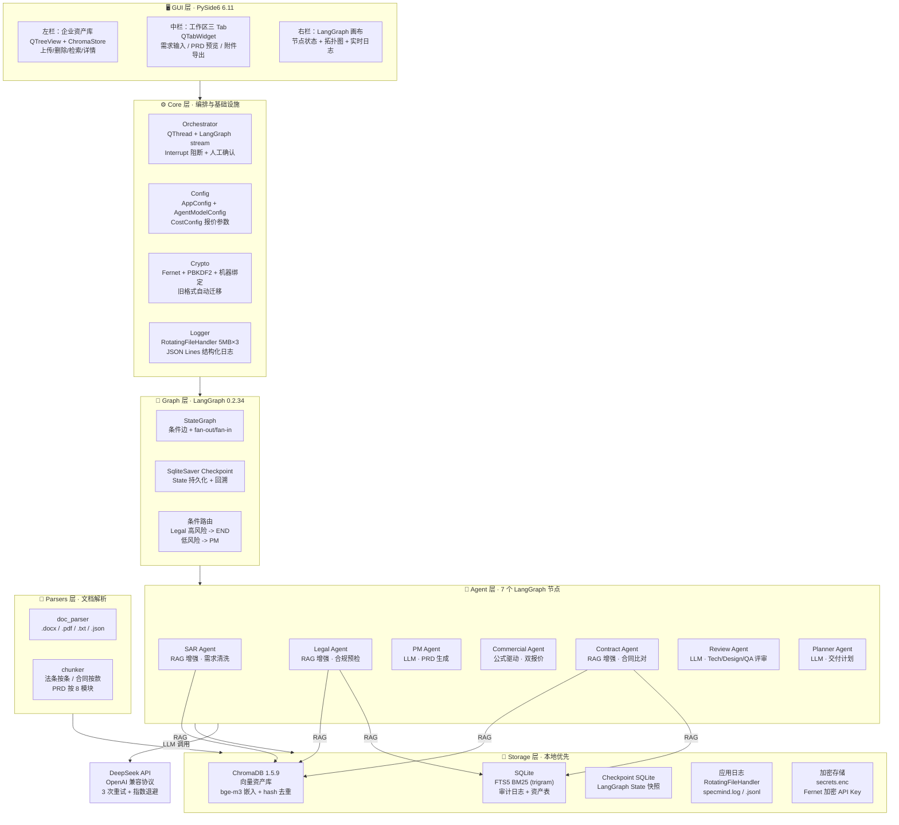
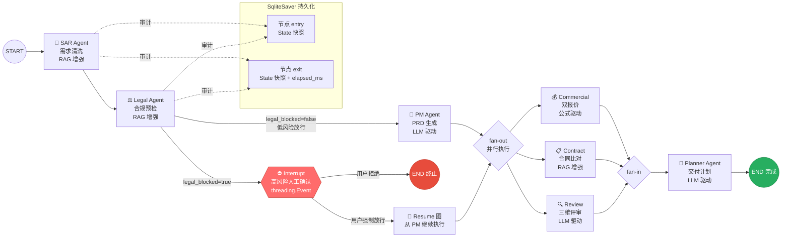
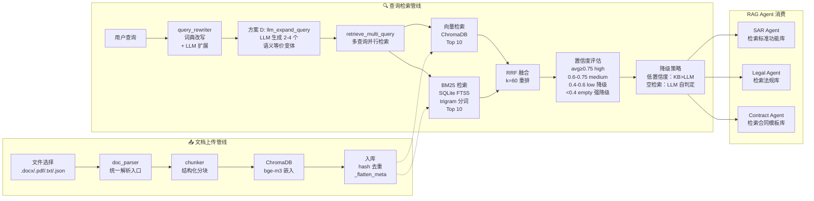
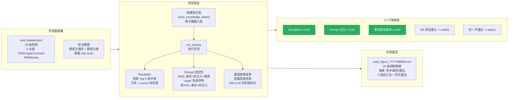

<div align="center">

# SpecMind Desktop

### AI 驱动的 ToB 标准化 PRD 产出平台

将脏销售需求（微信记录 / 口头承诺 / 文档）在 **15 分钟** 内转化为可落地的标准化 PRD + 报价 + 合同比对 + 评审 + 交付计划

[](https://github.com/ruyunai/SpecMind-Desktop/releases)
[](https://github.com/ruyunai/SpecMind-Desktop/releases)
[](LICENSE)

</div>

---

## 📥 立即下载

| 项目 | 说明 |
|------|------|
| **下载链接** | [SpecMindDesktop.exe](https://github.com/ruyunai/SpecMind-Desktop/releases/latest/download/SpecMindDesktop.exe) |
| **文件大小** | 130.52 MB |
| **系统要求** | Windows 10 / 11 64 位 |
| **无需安装** | 双击即用，无需 Python 或任何依赖 |

> 💡 若浏览器直接播放或预览，请右键链接 → 「链接另存为」下载。
> 首次启动若提示缺 `VCRUNTIME140.dll`，安装 [VC++ Redistributable 2015-2022](https://aka.ms/vs/17/release/vc_redist.x64.exe)。

---

## 🚀 快速开始（3 步）

### 1️⃣ 下载并启动

点击上方下载链接获取 `SpecMindDesktop.exe` → 双击运行。

> 若被 Windows SmartScreen 拦截：点击「更多信息」→「仍要运行」（exe 未代码签名，属正常现象）。

### 2️⃣ 配置 API Key

应用启动后，按 `Ctrl + ,` 打开模型配置：

- **API Key**：粘贴你的 DeepSeek API Key（格式 `sk-xxxxxxxx`）
  - 没有就到 https://platform.deepseek.com/ 注册并充值 ¥10
- **Base URL**：保持默认 `https://api.deepseek.com/v1`
- **模型**：保持默认 `deepseek-chat`
- 点击「保存」（Key 自动 Fernet 加密存储，绝不明文落盘）

### 3️⃣ 上传企业文档 + 执行工作流

1. **左栏**「企业资产库」→ 点击「上传」→ 选择企业文档（`.docx` / `.pdf` / `.txt`）
   - 推荐上传：企业标准功能清单、相关法规、合同模板
2. **中栏**输入需求（例如：`客户：XX教育；需求：在线教育平台含课程和支付`）
3. 点击「开始执行」（或 `Ctrl+Enter`）
4. **右栏** 7 个 Agent 节点依次变绿（约 60-90 秒）→ 中栏生成完整 PRD

---

## ✨ 核心功能

| 模块 | 能力 |
|------|------|
| **7 Agent 协同** | SAR（需求清洗）→ Legal（合规预检）→ PM（PRD 生成）→ Commercial（报价）+ Contract（合同比对）+ Review（三维评审）→ Planner（交付计划） |
| **企业知识库** | 本地 ChromaDB 向量库 + SQLite FTS5 BM25 混合检索，支持企业自有文档上传 |
| **高风险阻断** | Legal 检测高风险自动 Interrupt，弹出人工确认对话框，强放行需自负风险 |
| **标准 PRD 模板** | 8 个强制模块：背景目标 / 用户故事 / 功能列表 / In-Out 范围 / 验收标准 / 非功能需求 / 埋点要求 / 风险章节 |
| **功能点标注** | 每个功能点自动标注「标准功能 / 定制功能 / 暂不支持」 |
| **双报价生成** | 标准版 + 裁剪版动态报价，基于企业成本参数公式驱动 |
| **完整审计** | 每个 Agent 节点 entry/exit 快照入 SQLite，含耗时统计 |
| **本地优先** | 全部数据本地存储，禁止任何云端协作/上报依赖 |

---

## 📦 部署方式

| 方式 | 适用场景 | 说明 |
|------|---------|------|
| **exe 双击运行** | 单台电脑长期使用 | 数据存于 `%APPDATA%\SpecMindDesktop\` |
| **U 盘便携模式** | 多电脑切换、外勤演示 | exe 同级创建空文件 `portable.dat` 即可 |
| **源码部署** | 开发者二次开发 | `git clone` + `pip install -r requirements.txt` |

### U 盘便携模式（3 步）

```powershell
# 1. 在 U 盘创建目录
mkdir E:\SpecMindDesktop

# 2. 拷贝 exe
copy SpecMindDesktop.exe E:\SpecMindDesktop\

# 3. 创建便携标记文件（空文件即可）
New-Item -Path E:\SpecMindDesktop\portable.dat -ItemType File

# 完成！U 盘插任何电脑双击 exe 即可，数据全部写入 U 盘
```

📖 **完整部署手册**：[docs/deploy.md](docs/deploy.md)（含三种模式详细步骤、U 盘迁移流程、备份恢复、12 类常见问题排查）

---

## 🏗️ 项目架构

### 1. 整体架构（六层分离）



**技术栈**：PySide6 + LangGraph 0.2 + ChromaDB + SQLite FTS5 + DeepSeek API + PyInstaller

### 2. LangGraph Agent 工作流



### 3. RAG 混合检索架构



### 4. 评测体系（三指标 + CI 门禁）



**当前指标**：Recall@5 = 0.92 ✅ ｜ Prompt 安全 = 1.00 ✅ ｜ 置信度降级率 = 1.00 ✅

📖 **完整 10 张架构图**：[docs/架构设计_Mermaid图集.md](docs/架构设计_Mermaid图集.md)（含 State 管理 / 数据流 / 存储分层 / 加密 / 模型路由 / 打包部署等 6 张图）

📖 **架构设计说明文档**：[memory-bank/架构设计.md](memory-bank/架构设计.md)

---

## 📚 文档导航

| 文档 | 内容 |
|------|------|
| [docs/deploy.md](docs/deploy.md) | 完整部署操作手册（12 节 + 2 附录） |
| [docs/usage.md](docs/usage.md) | 7 步使用指南 |
| [docs/架构设计_Mermaid图集.md](docs/架构设计_Mermaid图集.md) | 10 张 Mermaid 架构图（整体架构/工作流/RAG/State/数据流/存储/加密/路由/打包/评测） |
| [docs/skill数据报告.md](docs/skill数据报告.md) | 4 个 AI Skill 使用数据报告（效率提升 66% / 32 Bug 修复归档 / 三指标提升） |
| [docs/eval_report_20260714.md](docs/eval_report_20260714.md) | RAG 评测报告（25 条用例 / Recall@5=0.92 / Prompt=1.00） |
| [AGENTS.md](AGENTS.md) | AI 编程代理工作指南（含代码规范、约束） |
| [memory-bank/](memory-bank/) | 项目记忆库（架构 / 状态 / 进度 / 修复日志） |

---

## 🔧 开发者指南

```powershell
# 环境准备
git clone https://github.com/ruyunai/SpecMind-Desktop.git
cd SpecMind-Desktop
python -m venv .venv
.venv\Scripts\activate
pip install -r requirements.txt

# 启动开发模式
python src/main.py

# 运行测试
python tests/test_stability_core.py        # 核心稳定性 54 项
python tests/test_production_readiness.py  # 生产就绪 18 项
pytest tests/ -v                           # 全套测试

# 构建 exe
pyinstaller --noconfirm SpecMindDesktop.spec
```

📖 详细开发规范见 [AGENTS.md](AGENTS.md)。

---

## 🛡️ 安全与合规

- **本地优先**：全部数据本地存储，禁止任何云端协作/上报依赖
- **API Key 加密**：Fernet + PBKDF2 + 机器绑定，绝不明文落盘
- **Legal 辅助预检**：Legal Agent 输出必附「辅助预检，非正式法律意见」声明
- **完整审计**：每个 LangGraph 节点 entry/exit 快照入 SQLite

---

## 📝 版本历史

### v0.2.0（2026-07-14）

**架构升级 + 人工测试迭代修复 + exe 打包链路修复**

- 🔧 **核心架构变更**：LLM 知识为主 + 企业资产库为辅（替代原 RAG 强约束设计）
- 📄 **文档解析增强**：docx 表格提取 + pdf 换用 pdfplumber（表格还原准确率 90%+）
- 🖥️ **UI 优化**：Interrupt 阻断弹窗改为可滚动自定义对话框
- 🐛 修复 BUG-023 ~ BUG-030 共 8 项（2 致命 + 6 高危）
  - BUG-030（致命）：exe 打包后 LLM 静默回退 mock 数据 → SSL 证书打包 + llm_errors 追踪 + 显式标注
  - BUG-029：Interrupt 弹窗内容过长无法滚动
  - BUG-026（致命）：LLM 只参考企业资产库 → 全部 Prompt 重写
- 📦 **exe 打包修复**：collect_all(chromadb) + certifi 证书 + openai/httpx 全量打包

详见 [Release v0.2.0](https://github.com/ruyunai/SpecMind-Desktop/releases/tag/v0.2.0)。

### v0.1.1（2026-07-14）

- 修复 BUG-009 ~ BUG-022 共 14 项（2 致命 + 12 高危）
- 新增核心稳定性测试 54 项 + 完整部署手册
- 建立 AGENTS.md 标准 AI 代理工作指南

详见 [Release v0.1.1](https://github.com/ruyunai/SpecMind-Desktop/releases/tag/v0.1.1)。

---

## 📄 License

MIT License - 详见 [LICENSE](LICENSE)

---

## 💬 反馈与支持

- **Bug 反馈**：[提交 Issue](https://github.com/ruyunai/SpecMind-Desktop/issues/new)
- **使用问题**：先查阅 [docs/deploy.md#常见问题排查](docs/deploy.md)
- **查看日志**：`%APPDATA%\SpecMindDesktop\logs\specmind.log`

---

<div align="center">

**⬇️ 立即下载：[SpecMindDesktop.exe](https://github.com/ruyunai/SpecMind-Desktop/releases/latest/download/SpecMindDesktop.exe)**

</div>
