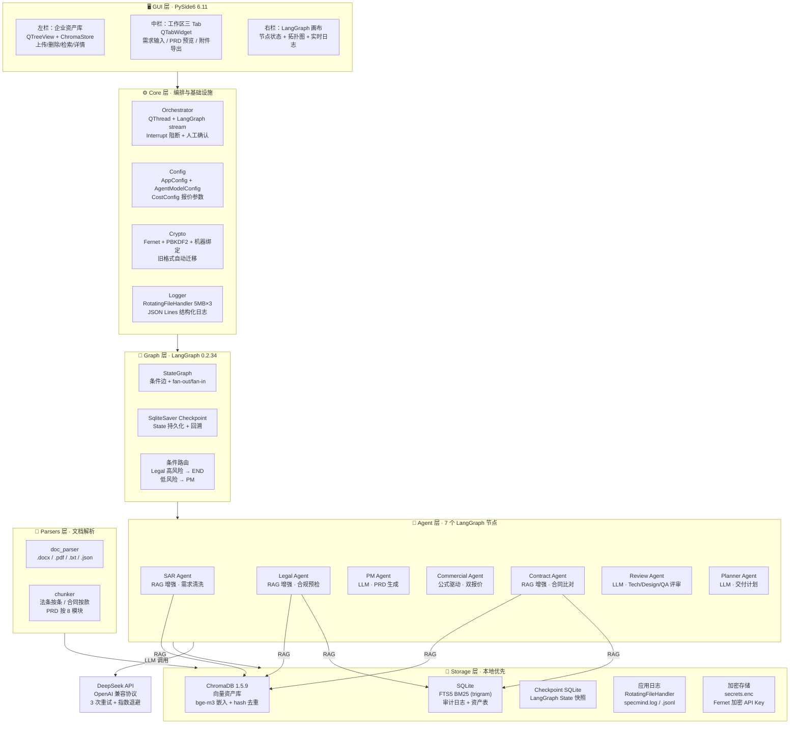
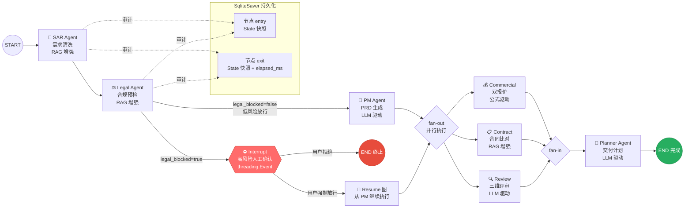
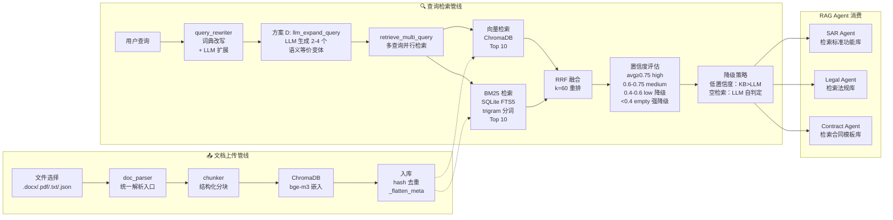
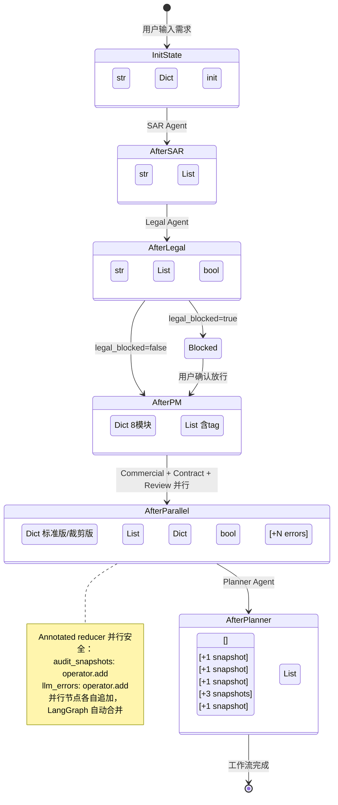
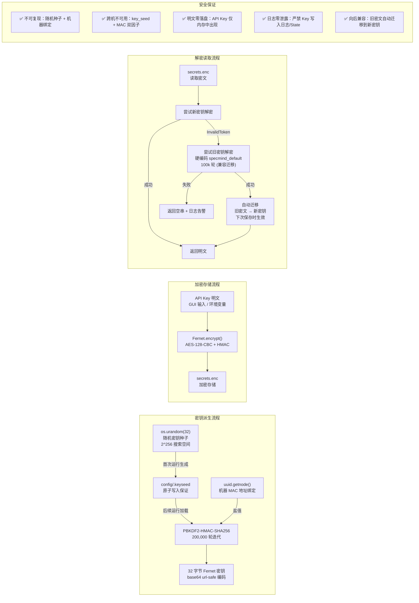
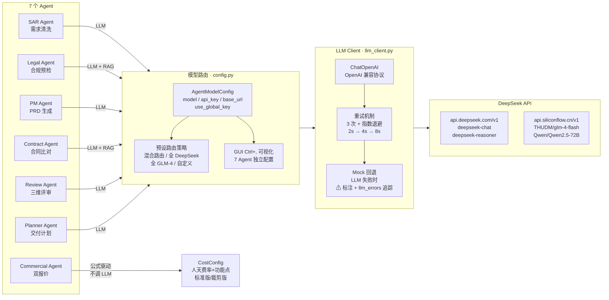
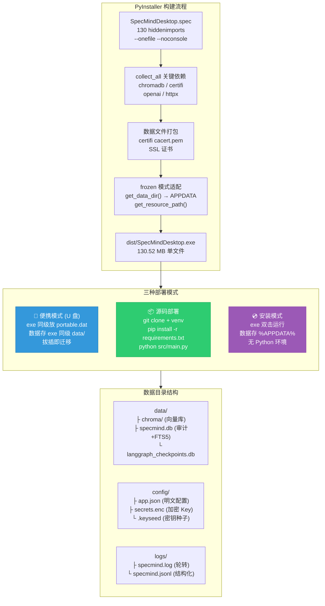
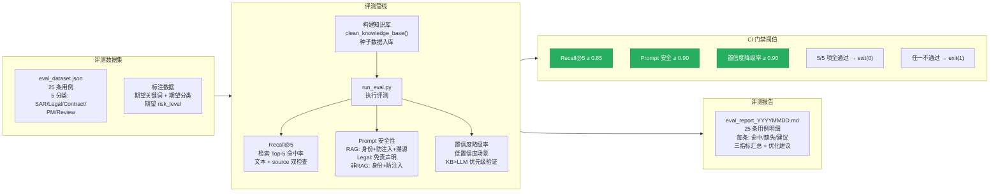

# SpecMind Desktop 架构设计 Mermaid 图集

> 本文档以 10 张 Mermaid 图全景呈现 SpecMind Desktop 的架构设计，每张图配有标题、详细标注与设计决策说明。

---

## 1. 项目整体架构图



**设计决策说明：**

- **六层分离**：GUI / Core / Agent / Graph / Storage / Parsers 各层职责明确，层间通过信号槽（GUI↔Core）和 State dict（Core↔Agent↔Graph）通信，降低耦合。
- **本地优先**：所有数据存储层（ChromaDB/SQLite/日志/加密）均在本地，唯一外部调用是 DeepSeek API，满足数据不出企业的硬约束。
- **Agent 分流**：SAR/Legal/Contract 使用 RAG 增强检索企业知识库；PM/Review/Planner 直接调用 LLM；Commercial 纯公式计算不调 LLM，兼顾质量与成本。

---

## 2. LangGraph Agent 工作流图



**设计决策说明：**

- **双图架构**：主图（SAR→Legal→路由）和 resume 图（PM→fan-out→Planner）分开编译。Legal 高风险时主图路由到 END，用户确认后运行 resume 图，避免 State 污染。
- **Interrupt 实现**：因 LangGraph 0.2.x 无原生 `interrupt()`，采用 `threading.Event` 阻塞 QThread，GUI 弹确认对话框后 `set()` 解除阻塞。
- **并行安全**：Commercial/Contract/Review 三个节点并行执行（fan-out），State 中 `audit_snapshots` 和 `llm_errors` 使用 `Annotated[List, operator.add]` reducer 确保并行追加不丢失。
- **审计完整**：每个节点 entry/exit 都写入 SQLite 审计日志（含 run_id、elapsed_ms），支持任意节点回溯。

---

## 3. RAG 架构图



**设计决策说明：**

- **方案 D（LLM 增强查询改写）**：`query_rewriter` 先用词典扩展关键词，再调用 LLM 生成 2-4 个语义等价查询变体，多查询并行检索后 RRF 融合，Recall@5 从 0.76 提升到 0.92。LLM 扩展失败自动回退单查询，零影响。
- **混合检索 + RRF**：向量检索（语义相似）和 BM25（关键词匹配）互补，RRF（Reciprocal Rank Fusion, k=60）融合重排，兼顾语义匹配与关键词精确匹配。
- **FTS5 trigram**：从 unicode61 迁移到 trigram（3 字符滑窗），中文短语匹配能力大幅提升；短查询（<3 字符）走 LIKE 回退，长查询（≥6 字符）用 4 字符滑窗 OR 合并。
- **四档置信度策略**：high/medium 正常使用；low 触发降级提示"知识库覆盖不足"；empty 由 LLM 用自身知识判定（Legal/Contract），LLM 也失败才阻断。
- **知识库优先**：三档融合策略确保 KB 检索结果优先级始终高于 LLM 自身知识，低置信度场景仍然"以知识库为主要依据"。

---

## 4. State 管理图



**设计决策说明：**

- **TypedDict 强类型**：`SpecMindState` 使用 `TypedDict(total=False)` 定义，所有字段类型明确，IDE 补全友好。
- **部分更新**：每个 Agent 只返回本节点新增/更新的字段（部分 dict），LangGraph 自动合并到全局 State，避免 `InvalidUpdateError`。
- **Annotated reducer**：`audit_snapshots` 和 `llm_errors` 使用 `Annotated[List, operator.add]`，并行节点（Commercial/Contract/Review）各自追加，LangGraph 自动合并，不丢失不覆盖。
- **FeatureTag 枚举**：`标准功能/定制功能/暂不支持` 三个标注值，PM Agent 为每个功能点打标签，Commercial Agent 据此分类计价。
- **legal_risk_level 为 str**：存字符串而非 RiskLevel 枚举，避免 LangGraph 序列化/反序列化时的 `ValidationError` 警告。

---

## 5. 数据流图

```mermaid
sequenceDiagram
    participant User as 👤 用户
    participant GUI as 🖥 GUI (主线程)
    participant Orch as ⚙ Orchestrator (QThread)
    participant Graph as 🔗 LangGraph
    participant SAR as 🧹 SAR
    participant Legal as ⚖ Legal
    participant PM as 📝 PM
    participant Par as 💰📋🔍 并行三节点
    participant Planner as 📅 Planner
    participant Audit as 💾 SQLite 审计

    User->>GUI: 输入脏需求 + 点击执行
    GUI->>Orch: start() 启动 QThread
    Orch->>Audit: workflow start (run_id)

    Orch->>Graph: stream(initial_state)
    Graph->>SAR: execute(state)
    SAR->>Audit: entry snapshot
    SAR-->>Graph: {cleaned_requirements, overcommit_risks}
    Graph-->>Orch: SAR event
    Orch->>GUI: node_started("sar_agent")
    Orch->>Audit: exit snapshot + elapsed_ms
    Orch->>GUI: node_finished("sar_agent", elapsed)

    Graph->>Legal: execute(state)
    Legal->>Audit: entry snapshot
    Legal-->>Graph: {legal_risk_level, legal_blocked}
    Graph-->>Orch: Legal event (blocked=true)
    Orch->>GUI: workflow_blocked(reason, state)

    GUI->>User: 弹出 InterruptConfirmDialog
    alt 用户确认放行
        User->>GUI: 点击"强制放行"
        GUI->>Orch: confirm_resume()
        Orch->>Graph: stream(resume_state)
        Graph->>PM: execute(state)
        PM-->>Graph: {prd, prd_features}
        Graph->>Par: fan-out 并行
        Par-->>Graph: {quotes, contract_conflicts, review_comments}
        Graph->>Planner: execute(state)
        Planner-->>Graph: {delivery_plan}
    else 用户拒绝放行
        User->>GUI: 点击"拒绝放行"
        GUI->>Orch: reject_resume()
    end

    Orch->>Audit: workflow complete/rejected
    Orch->>GUI: workflow_complete(state)
    GUI->>User: 渲染 PRD + 报价 + 交付计划
```

**设计决策说明：**

- **QThread 异步**：Orchestrator 继承 QThread 在后台执行 LangGraph stream，主线程只负责 UI 更新，避免 LLM 调用阻塞界面。
- **信号驱动**：`node_started`/`node_finished`/`workflow_blocked`/`workflow_complete` 四个信号驱动 GUI 更新，解耦 UI 与业务逻辑。
- **三层终止**：`cancel()` 设置取消标志 + 解除 Event 阻塞 → `wait(3000)` 等待自然退出 → `terminate()` 强制终止兜底。
- **审计全链路**：每个节点 entry/exit 都写审计日志（含 run_id、elapsed_ms），支持按 run_id 回溯完整执行过程。
- **stream 滞后**：LangGraph 0.2.x `stream_mode="updates"` 在节点返回后才 yield 事件，`node_started` 信号存在天然滞后，elapsed_ms 优先从节点内部 `_make_snapshot` 读取。

---

## 6. 存储分层图

```mermaid
graph TB
    subgraph PathResolve["路径解析规则"]
        Portable["便携模式<br/>exe 同级 portable.dat 存在<br/>→ exe 同级目录"]
        Dev["开发模式<br/>python src/main.py<br/>→ 项目根目录"]
        Frozen["Frozen 模式<br/>PyInstaller exe<br/>→ %APPDATA%/SpecMindDesktop/"]
    end

    subgraph Storage["存储组件"]
        direction TB
        Chroma["ChromaDB 1.5.9<br/>向量资产库<br/>bge-m3 嵌入<br/>hash 去重 + _flatten_meta"]
        SQLiteMain["SQLite<br/>specmind.db<br/>├ audit_logs (审计日志)<br/>├ assets (资产 FTS5)<br/>└ FTS5 trigram 索引"]
        SQLiteCKPT["SQLite<br/>langgraph_checkpoints.db<br/>LangGraph State 持久化<br/>SqliteSaver 3.1.0"]
        AppLog["应用日志<br/>specmind.log + .1/.2/.3<br/>RotatingFileHandler 5MB×3<br/>specmind.jsonl (frozen)"]
        Secret["加密存储<br/>config/secrets.enc<br/>Fernet 加密 API Key<br/>config/.keyseed (密钥种子)"]
        AppConfig["明文配置<br/>config/app.json<br/>base_url / 模型映射 / 路径"]
    end

    subgraph DataFlow["数据流向"]
        RAG_Query["RAG 查询<br/>向量 + BM25 + RRF"]
        Audit_Write["审计写入<br/>节点 entry/exit 快照"]
        Checkpoint_Write["Checkpoint 写入<br/>LangGraph 每步 State"]
        Log_Write["日志写入<br/>结构化 JSON Lines"]
        Key_Write["密钥写入<br/>加密存储/读取"]
    end

    Chroma <-- RAG_Query
    SQLiteMain <-- RAG_Query
    SQLiteMain <-- Audit_Write
    SQLiteCKPT <-- Checkpoint_Write
    AppLog <-- Log_Write
    Secret <-- Key_Write

    PathResolve --> Storage
```

**设计决策说明：**

- **三种路径模式**：便携模式（U 盘）、开发模式（项目根）、Frozen 模式（%APPDATA%），通过 `is_portable()` 和 `sys.frozen` 检测自动切换，核心逻辑在 `core/__init__.py`。
- **双 SQLite**：`specmind.db` 存审计日志和 FTS5 索引；`langgraph_checkpoints.db` 存 LangGraph checkpoint，两者职责分离，避免锁竞争。
- **ChromaDB 1.5.9**：从 0.5.x 升级解决 `hnswlib` 无 Python 3.14 wheel 问题；遥测默认禁用（`anonymized_telemetry=False`），满足本地优先约束。
- **FTS5 trigram**：3 字符滑窗分词替代 unicode61 单字切分，中文短语匹配从 0% 提升到 70%；短查询走 LIKE 回退，长查询用 4 字符滑窗 OR 合并。
- **日志轮转**：RotatingFileHandler 5MB×3 份，frozen 模式额外启用 JSON Lines 结构化日志（specmind.jsonl）。

---

## 7. 安全与加密架构图



**设计决策说明：**

- **PBKDF2 + 机器绑定**：密钥派生使用 200k 轮 PBKDF2-HMAC-SHA256，盐值为 `uuid.getnode()`（MAC 地址），双因子（key_seed + machine_id）防止跨机器拷贝解密。
- **Fernet 对称加密**：API Key 使用 Fernet（AES-128-CBC + HMAC-SHA256）加密存储，密文写入 `secrets.enc`，明文仅出现在内存中。
- **旧格式迁移**：旧方案使用硬编码 `"specmind_default"` 派生密钥（100k 轮），新密钥解密失败时自动尝试旧密钥，成功后标记 `needs_migration`，下次保存配置时自动迁移到新密钥。
- **原子写入**：key_seed 通过临时文件 + `replace()` 原子替换写入，避免写入中断导致密钥文件损坏。
- **环境变量优先**：`SPECMIND_API_KEY` 环境变量优先于加密存储，方便 CI/CD 场景。

---

## 8. 模型路由图



**设计决策说明：**

- **统一 LLM 抽象**：所有 Agent 通过 `ChatOpenAI`（langchain-openai）接入，兼容 OpenAI 协议的任意 API 端点（DeepSeek / 硅基流动 / 其他）。
- **按 Agent 独立配置**：每个 Agent 可单独设置 model/api_key/base_url，GUI（Ctrl+,）提供可视化配置 + 预设路由一键应用。
- **Commercial 不调 LLM**：报价使用 `CostConfig`（人天费率×标准功能数×倍率）公式驱动，预算可控、结果可复现。
- **3 次重试 + 指数退避**：`llm_client.py` 内置重试机制（2s→4s→8s），网络抖动或限流时自动重试。
- **失败显式标注**：LLM 调用失败不再静默回退 mock，而是标注 `⚠ LLM 调用失败` 并写入 `state.llm_errors`，GUI 完成后弹警告。

---

## 9. 打包与部署图



**设计决策说明：**

- **单文件 exe**：PyInstaller `--onefile` 模式打包，输出 130.52 MB 自包含 exe，无需 Python 环境即可运行。
- **130 hiddenimports**：PySide6/LangGraph/ChromaDB/OpenAI 等动态导入依赖需显式声明，spec 文件覆盖全量依赖。
- **SSL 证书**：`collect_data_files('certifi')` 打包 CA 证书，解决 exe 中 HTTPS 请求 SSL 验证失败问题（BUG-030）。
- **三种部署**：便携模式（U 盘 + portable.dat）适合数据隔离场景；源码部署适合开发者；安装模式（双击 exe）适合终端用户。
- **路径自动适配**：`core/__init__.py` 的 `get_app_root()`/`get_data_dir()` 根据 `sys.frozen` 和 `portable.dat` 自动切换数据目录。

---

## 10. 评测体系图



**设计决策说明：**

- **三指标体系**：Recall@5（检索质量）、Prompt 安全性（工程化质量）、置信度降级率（知识库优先级保证），覆盖 RAG 系统三个核心维度。
- **Agent 类型区分**：Prompt 安全评测按 Agent 类型区分检查项——RAG Agent（SAR/Legal/Contract）检查身份定位+防注入+溯源；Legal 额外检查免责声明；非 RAG Agent（PM/Review/Planner）检查身份定位+防注入+职责清晰度，避免一刀切。
- **CI 门禁**：`test_eval_regression.py` 五项阈值断言，任一不通过 `exit(1)` 阻止合并，确保每次迭代不回退。
- **知识库隔离**：评测前 `clean_knowledge_base()` 清空旧数据重新构建，避免历史数据污染导致结果不稳定。
- **当前指标**：Recall@5=0.92 / Prompt 安全=1.00 / 置信度降级率=1.00，三项均超过阈值。

---

## 附录：架构关键数字

| 维度 | 数值 |
|------|------|
| Agent 节点数 | 7 |
| PRD 强制模块 | 8 |
| State 字段数 | 15（含 2 个 Annotated reducer） |
| 并行节点数 | 3（Commercial/Contract/Review） |
| 审计快照/次 | 7+（每节点 entry+exit） |
| PyInstaller hiddenimports | 130 |
| exe 体积 | 130.52 MB |
| PBKDF2 迭代 | 200,000 轮 |
| LLM 重试 | 3 次 + 指数退避 2s→4s→8s |
| 日志轮转 | 5MB × 3 份 |
| FTS5 分词 | trigram（3 字符滑窗） |
| RRF 常数 k | 60 |
| 评测用例 | 25 条 |
| 当前 Recall@5 | 0.92 |
