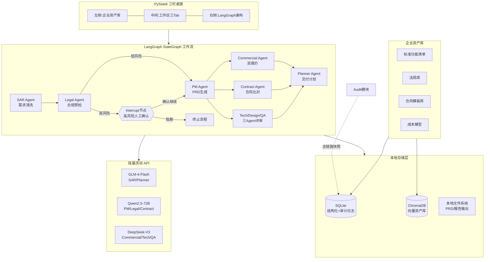

# 架构设计

## 整体架构（Mermaid）



## 设计模式
- **Agent 编排模式**：LangGraph StateGraph，有向图 + 条件边 + Interrupt
- **状态管理模式**：全局 State 对象在节点间传递，每个 Agent 读+写特定字段
- **存储分层模式**：结构化数据 → SQLite；非结构化语义检索 → ChromaDB；产出文件 → 本地 FS
- **加密模式**：Fernet 对称加密 API Key，密钥派生自本机特征 + 用户密码
- **审计模式**：每个节点执行前后打 State 快照入 SQLite，支持任意节点回溯

## 组件依赖
```
SpecMind Desktop
├── GUI 层: PySide6 (Qt for Python)
│   ├── 三栏 QMainWindow 布局
│   ├── 左栏: QTreeView + QStandardItemModel (资产库，lazy ChromaStore 加载)
│   ├── 中栏: QTabWidget (需求输入/PRD预览/配套附件) + QLineEdit (client_name)
│   └── 右栏: LangGraph 画布渲染（节点高亮）
├── 编排层: LangGraph StateGraph
│   ├── 7 Agent 节点（SAR/Legal/Contract 使用 RAG 增强，PM/Commercial/Review/Planner 使用 mock）
│   ├── 1 Interrupt 节点
│   └── 条件边路由
├── RAG 检索层
│   ├── rag_agents.py - 3 个 RAG Agent（SAR/Legal/Contract）
│   ├── retriever.py - 混合检索（ChromaDB 向量 + FTS5 BM25 + RRF 融合）
│   ├── query_rewriter.py - 查询改写（关键词字典扩展）
│   └── confidence.py - 置信度评估 + 低置信度阻断
├── 模型层: langchain-openai (OpenAI compatible)
│   └── 硅基流动 endpoint + 混合路由
├── 存储层
│   ├── sqlite3 (标准库) - 审计日志+结构化资产+FTS5 BM25（trigram 分词）
│   ├── chromadb - 向量资产库（bge-m3 嵌入 + _flatten_meta 兼容）
│   └── cryptography.fernet - API Key 加密
├── 解析层
│   ├── python-docx - Word 解析
│   └── PyPDF2 - PDF 解析
└── 打包: PyInstaller (单文件 exe)
```

## 数据流
1. **输入流**：用户导入脏数据（文本/JSON/Word/PDF）→ 解析为统一文本 → 存入 State
2. **清洗流**：SAR 读取 State.input → 混合检索（ChromaDB 向量 + FTS5 BM25 + RRF 融合）对齐标准功能 → 写入 State.cleaned_requirements
3. **合规流**：Legal 读取 State.cleaned_requirements → 混合检索法规库 → 输出风险等级 → 高风险触发 Interrupt
4. **生成流**：PM 读取 State（清洗+合规）→ 按 8 模板模块生成 PRD → 写入 State.prd
5. **校验流**：Commercial/Contract/Review 并行读取 State.prd → 各自输出 → 写入 State
   - Contract 使用 RAG 混合检索合同模板（query_rewriter 改写 → 向量+BM25+RRF → 置信度评估）
6. **计划流**：Planner 汇总所有输出 → 生成交付计划
7. **审计流**：每个节点 entry/exit 触发 Audit 快照写入 SQLite

## 安全决策
- API Key：Fernet 加密存储，严禁明文落盘
- 数据隔离：全部本地，无任何网络上报（除硅基流动 API 调用）
- 高风险操作：LangGraph Interrupt 强制人工确认，不得自动执行
- Legal 声明：所有 Legal 输出必须附带"辅助预检，非正式法律意见"声明

## 部署架构
- **目标**：单文件 Windows exe，无 Python 环境可运行
- **打包**：PyInstaller --onefile，bundling Python 运行时 + 所有依赖
- **数据目录**：%APPDATA%/SpecMindDesktop/（数据库、资产、输出）
- **配置目录**：%APPDATA%/SpecMindDesktop/config/（加密 API Key）
- **启动优化**：延迟加载 ChromaDB/模型 SDK，先渲染 GUI
